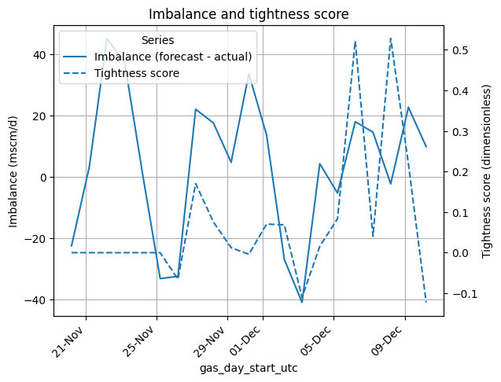
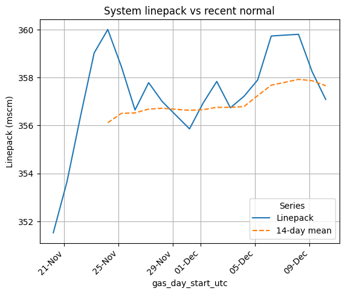

# GB Gas Tightness – 2025-12-10

## Headline

- System assessed as **neutral** on the day.
- Latest tightness score: **-0.12**
- Latest linepack: **357** (-0.51σ vs recent normal).

## Charts

## Recent 7-day summary

| Gas day | Label | Score | Min lp dev (σ) | Max lp dev (σ) |
|---------|-------|-------|----------------|----------------|
| 2025-12-04 | neutral | +0.02 | +0.01 | +0.01 |
| 2025-12-05 | neutral | +0.08 | +0.33 | +0.33 |
| 2025-12-06 | neutral | +0.52 | +1.57 | +1.57 |
| 2025-12-07 | neutral | +0.04 | +nan | +nan |
| 2025-12-08 | neutral | +0.53 | +1.78 | +1.78 |
| 2025-12-09 | neutral | +0.22 | +0.51 | +0.51 |
| 2025-12-10 | neutral | -0.12 | -0.51 | -0.51 |